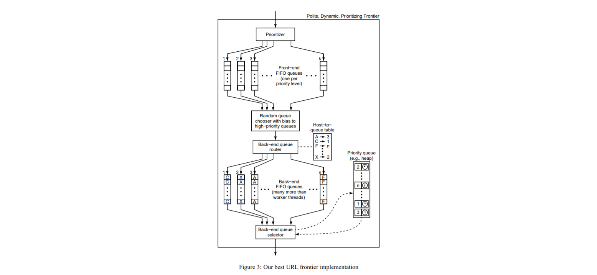

# MicroFrontier &middot; [](https://npm-stat.com/charts.html?package=microfrontier) [](https://www.npmjs.com/package/microfrontier)  

A web crawler frontier implementation in TypeScript backed by Redis.
MicroFrontier is a scalable and distributed frontier implemented through Redis Queues.

- [x] Fast Ingestion & High throughput
- [x] Multiple priority queues
- [x] Custom priority strategy
- [x] Per-Hostname crawl rate limit or default delay fallback
- [x] Easy to use HTTP Microservice 
- [x] Multi-processing support

<br>
Example of Mercator Frontier[^1]



## Usage

MicroFrontier can be used both as a Javascript library SDK, from the command line or with a Docker deploy.

### Command Line
Install microfrontier with:
```
npm i -g microfrontier
```
Run microfrontier
```bash
microfrontier --port 3035 --redis:host localhost #see configuration for other parameters
```


### As a package
Npm:
```
npm i microfrontier
```
Yarn:
```
yarn add microfrontier
```

### Docker
```
docker pull adileo/microfrontier
```

## Configuration

| ENV VAR  | CLI PARAMS | Description |
| ------------- | --- |------------- |
| host  | --host | Host name to start the microservice http server. <br>Default value: `127.0.0.1`  
| port  | --port| Port to start the microservice http server.<br> Default value: `8090`   |
| redis_host | --redis:host | Redis server host.<br> Default value: `127.0.0.1`   |
| redis_port | --redis:port | Redis server port.<br> Default value: `6379`   |
| redis_* | --redis:* | Parameters are interpreted by `nconf` and passed to `ioredis` as the client config.  
| config_frontierName | --config:frontierName | Prefix used for Redis keys.  |
| config_* | --config:* | Parameters are interpreted by `nconf`, default value below.  |

```typescript
{
    frontierName: 'frontier',
    priorities: {
        'high':     {probability: 0.6},
        'normal':   {probability: 0.3},
        'low':      {probability: 0.1},
    },
    defaultCrawlDelay: 1000
}
```

# How to
## Adding an URL to the frontier
Via HTTP
```bash
curl --location --request POST 'http://127.0.0.1:8090/frontier' \
--header 'Content-Type: application/json' \
--data-raw '{
    "url": "http://www.example.com",
    "priority": "normal",
    "meta": {
        "foo": "bar"
    }
}'
```
Via SDK
```javascript
import { URLFrontier } from "microfrontier"

const frontier = new URLFrontier(config)

frontier.add("http://www.example.com", "normal", {"foo": "bar"}).then(() => {
    console.log('URL added')
})
```

## Getting an URL from the frontier
```bash
curl --location --request GET 'http://127.0.0.1:8090/frontier'
```
```javascript
import { URLFrontier } from "microfrontier"

const frontier = new URLFrontier(config)

frontier.get().then((item) => {
    // {url: "http://www.example.com", meta: {"foo":"bar"}}
})
```


[^1]: [High-Performance Web Crawling](http://www.cs.cornell.edu/courses/cs685/2002fa/mercator.pdf) - Marc Najork, Allan Heydon
